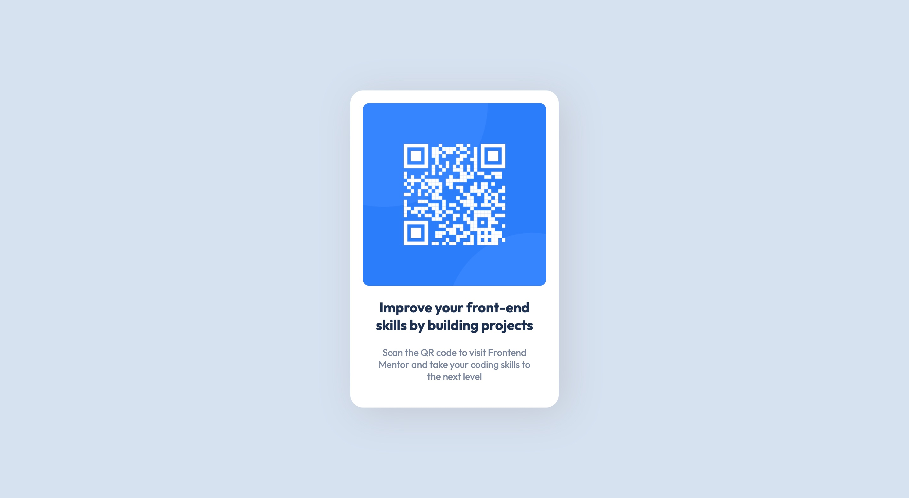

# Frontend Mentor - QR code component solution

This is a solution to the [QR code component challenge on Frontend Mentor](https://www.frontendmentor.io/challenges/qr-code-component-iux_sIO_H). Frontend Mentor challenges help you improve your coding skills by building realistic projects. 

## Table of contents

- [Overview](#overview)
  - [Screenshot](#screenshot)
  - [Links](#links)
- [My process](#my-process)
  - [Built with](#built-with)
  - [Useful resources](#useful-resources)
- [Author](#author)

## Overview

### Screenshot

### Links

- Solution URL: [My Solution](https://cosmic-churros-381c83.netlify.app)

## My process

### Built with

- Semantic HTML5 markup
- CSS custom properties
- Sass
- CSS Grid

### Useful resources

- [MDN Web Docs](https://developer.mozilla.org/en-US/)

## Author

- Website - [Chris Griffiths](https://www.your-site.com)
- Frontend Mentor - [@Chris-Griffiths](https://www.frontendmentor.io/profile/Chris-Griffiths)